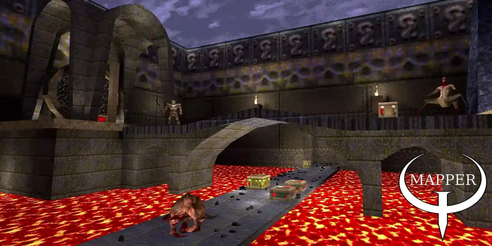

# Quake mapping plugin for Godot 4
<br>
Mapper plugin provides a way to manage game directories with map resources.<br>
Construct Godot scenes from maps using your own scripts and run them without the plugin.<br>
Organize map resources into game expansions by specifying alternative game directories.<br>

#### [Available in Godot Asset Library](https://godotengine.org/asset-library/asset/4016)
#### [Comprehensive Quake game profile for this plugin](https://github.com/ELF32bit/godot-mapper-quake)
#### [Additional tools for creating maps are available here](https://github.com/ELF32bit/mapping-tools)

## Features
* Import and progressive loading of complex maps as scenes in a deterministic way.
* Automatic loading of PBR textures, animated textures and shader material textures.
* Scattering, based on floor angle, of grass or enemies on textures and inside brushes.
* Effortless brush entity construction and animation using plugin functions.
* Safe entity property parsing and binding, entity linking and [grouping](https://github.com/ELF32bit/godot-mapper/blob/main/mapping/generic/builders/func_group.gd).
* Artist controllable [barycentric wireframes](https://github.com/ELF32bit/godot-mapper/blob/main/mapping/generic/shaders/wireframe.gdshader) via [face parameters](https://github.com/ELF32bit/godot-mapper/blob/main/addons/mapper/templates/__post.gd).
* Texture WAD (WAD2, WAD3) and Palette support.
* Basic MDL (IDPO version 6) support.

> Requires compiling Godot editor with **`XA_MULTITHREADED 0`** for lightmapping.

## Usage
### 1. Create game directory with map resources.
* game/builders for entity build scripts.
* game/materials for override materials with additional metadata.
* game/textures for textures with possible PBR or animation names.
* game/sounds for loading sounds with any of the supported extensions.
* game/maps for maps and possibly sub-maps defined in entity properties.
* game/mapdata for automatically generated lightmaps and navigation data.
* game/wads for texture WADs defined in map files.
* game/mdls for animated models.

> Add game configuration to the plugin **`importers/map-scene.gd`** file.

### 2. Construct map entities with build scripts.
Scripts inside builders directory are used to construct map entities.<br>
Entity **classname** property determines which build script the plugin will execute.<br>
Build scripts ending with underscore can be used to construct many similar entities.<br>
For example, **trigger_.gd** will be executed for **trigger_once** and **trigger_multiple** entities.<br>
Create entity node or nodes, set a script with **@export** annotations and bind entity properties.<br>
```GDScript
# info_player_start.gd
static func build(map: MapperMap, entity: MapperEntity) -> Node:
	var entity_node := Marker3D.new()
	entity_node.add_to_group("info_player_start", true)
	return entity_node # origin and angles are assigned automatically
```
```GDScript
# light_.gd
static func build(map: MapperMap, entity: MapperEntity) -> Node:
	var entity_node := OmniLight3D.new()
	entity_node.set_script(preload("../scripts/light.gd"))
	entity_node.omni_range = entity.get_unit_property("light", 300)
	entity_node.light_color = entity.get_color_property("_color", Color.WHITE)
	return entity_node # origin is assigned automatically (refer to 5. for angles)
```

#### MapperUtilities class provides smart build functions for brush entities.
```GDScript
# func_breakable.gd will create individual brushes
static func build(map: MapperMap, entity: MapperEntity) -> Node:
	return MapperUtilities.create_brush_entity(entity, "Node3D", "RigidBody3D")
```
```GDScript
# worldspawn.gd brushes will be merged into a single geometry
static func build(map: MapperMap, entity: MapperEntity) -> Node:
	return MapperUtilities.create_merged_brush_entity(entity, "StaticBody3D")
```
```GDScript
# trigger_multiple.gd will create Area3D with a single merged collision shape
static func build(map: MapperMap, entity: MapperEntity) -> Node:
	return MapperUtilities.create_merged_brush_entity(entity, "Area3D",
		false, true, false)
```
```GDScript
# func_decal.gd will create an improvised decal from a brush
static func build(map: MapperMap, entity: MapperEntity) -> Node:
	return MapperUtilities.create_decal_entity(entity)
```
Entity linking information is also available, but linked entities might not be constructed yet.<br>
```GDScript
# light_.gd
var entity_target := map.get_first_entity_target(entity,
	"target", "targetname", "info_null")
if entity_target:
	entity_target.get_origin_property(null) # for point entities
	entity_target.center # or default to AABB center for brush entities
	entity_target.node # is most likely missing!
```
Post build script named **__post.gd** can be executed after all entity nodes are constructed.<br>

### 3. Define map override materials with additional metadata.
Materials support the same naming pattern with underscore as build scripts, like **_.tres**.<br>
Moreover, material named **WOOD_.tres** will also apply to **WOOD1**, **WOOD2**, **WOOD123**, etc.<br>
Shader materials that use standard texture parameters will be assigned provided textures.<br>
For example, **albedo_texture** or **normal_texture** parameters inside a shader.<br>

#### Material metadata can affect how nodes of uniform brushes are generated.
* ```mesh_disabled``` set to True will hide MeshInstance3D.

> Meshes of uniform brushes will not be merged into entity mesh.

* ```cast_shadow``` set to False will disable shadow casting on MeshInstance3D.

> Meshes of uniform brushes will be excluded from entity shadow mesh.

* ```gi_mode``` will set MeshInstance3D gi_mode to the specified mode.
* ```ignore_occlusion``` set to True will disable MeshInstance3D culling.
* ```collision_disabled``` set to True will disable CollisionShape3D.

> Shapes of uniform brushes will not be merged into entity collision shape.

* ```collision_layer``` will set CollisionObject3D layer to the specified layer.
* ```collision_mask``` will set CollisionObject3D mask to the specified mask.
* ```occluder_disabled``` set to True will hide OccluderInstance3D.

> Occluders of uniform brushes will not be merged into entity occluder.

* ```occluder_mask``` will set OccluderInstance3D mask to the specified mask.
* ```physics_material``` will set StaticBody3D or RigidBody3D physics material.
* ```mass_density``` will affect material contribution to RigidBody3D mass.

> Non-uniform brushes require `use_approximate_mass` setting set to False.

Material metadata can be used to filter out special brushes from merged entities.<br>
Special **SKIP** material does not break the uniformity of such brushes.<br>
```GDScript
# WATER_.tres material
metadata/liquid = 1
metadata/mesh_disabled = true
metadata/collision_disabled = true
metadata/occluder_disabled = true

# worldspawn.gd (created as the merged brush entity)
for brush in entity.brushes:
	if not brush.get_uniform_property("liquid", 0) > 0:
		continue
	# liquid area is created at a global position
	var liquid_area := MapperUtilities.create_brush(entity, brush, "Area3D")
	if not liquid_area:
		continue
	# manually re-enabling disabled brush nodes
	for child in liquid_area.get_children():
		if child is MeshInstance3D:
			child.visible = true
		elif child is CollisionShape3D:
			child.disabled = false
		elif child is OccluderInstance3D:
			child.visible = true
	# parenting one global node to another with right local coordinates
	MapperUtilities.add_global_child(liquid_area, entity_node, map.settings)
```

> CSG merged brush entities use **brush.metadata** overwrites to re-enable disabled nodes.

### 4. Animated textures and material alternative textures.
Generic textures are using a complex naming pattern.<br>
Unlike in the examples below, a consistent naming is required.<br>
Animated and alternative textures require suffixes with the same word count.<br>

#### Animated texture with 3 frames, possibly followed by PBR suffix.
* texture-0.png
* texture-1_albedo.png
* texture-2.png

> AnimatedTexture resource can be created alongside for more control.

#### Material alternative textures, possibly followed by animated texture suffix.
* texture+0.png
* texture+1-0.png
* texture+1-1_albedo.png
* texture+1-2.png
* texture+2_albedo.png

> Alternative textures are saved into material metadata.

Quake textures with similar prefixes (+0, +1, +a, +b) can also be loaded.<br>
Plugin supports multiple loading schemes for various resources.<br>
Custom loader can be implemented for your own assets.<br>

### 5. Bind entity properties to node properties.
Simple entity properties can be bound to entity node properties.<br>
Assignment of node properties happens after entity node is constructed.<br>
Common entity properties such as origin, angle, angles (mangle) are already bound.<br>
```GDScript
entity.bind_int_property("hp", "health")
```
Often it's necessary to validate or modify entity properties before assigning.<br>
```GDScript
entity_node.health = clampi(entity.get_int_property("hp", 100), 10, 100)
```
Complex entity properties such as signals and node paths can also be bound.<br>
For example, trigger might need to send activation signals to nodes of other entities.<br>
```GDScript
# trigger_.gd will connect generic signal to the methods of targeted entities
entity.bind_signal_property("target", "targetname", "generic", "_on_generic_signal")
entity.bind_signal_property("killtarget", "targetname", "generic", "queue_free")
```
```GDScript
# path_corner.gd will be storing node paths to path_corner targets
entity.bind_node_path_array_property("target", "targetname", "_targets", "path_corner")
entity.bind_node_path_property("target", "targetname", "_target", "path_corner")
```
Other entity properties can be manually inserted into node properties dictionary.<br>
Changing automatically assigned properties (position, rotation) will adjust the pivot of an entity.<br>
```GDScript
# func_turnable.gd
var pivot_offset := Vector3.DOWN * entity.aabb.size.y / 2.0
entity.node_properties["position"] = entity.center + pivot_offset
return MapperUtilities.create_merged_brush_entity(entity, "AnimatableBody3D")
```
Some entities use different rotation modes for angles (mangle) property.
```GDScript
# light_.gd uses "PYR" (Pitch Yaw Roll) mode by default
entity.bind_mangle_property("rotation", "YpR")
```

### 6. Assign navigation regions and bind node groups.
Various entities might affect navigation regions differently.<br>
Use entity node groups to manage entity navigation groups.<br>
```GDScript
# worldspawn.gd
var navigation_region := MapperUtilities.create_navigation_region(map, entity_node)
MapperUtilities.add_to_navigation_region(entity_node, navigation_region)

# func_detail entities will affect worldspawn navigation region
for map_entity in map.classnames.get("func_detail", []):
	MapperUtilities.add_entity_to_navigation_region(map_entity, navigation_region)
	map_entity.node_groups.append("func_detail") # equivalent method!
```
Assignment of node groups happens after entity node is constructed.<br>

### 7. Generate surface and volume distributions.
Distributions are stored as transform arrays with basis and origin.<br>
**MapperUtilities** class provides functions for working with transform arrays.<br>
Spread function filters out nearby points, rotation function takes snap angles.<br>
```GDScript
# worldspawn.gd
var grass_multimesh := preload("../resources/multimesh.tres")
var grass_transform_array := entity.generate_surface_distribution(
	["GRASS*", "__TB_empty"], 1.0, 0.0, 60.0, false, false, 0)

MapperUtilities.spread_transform_array(grass_transform_array, 0.25)
MapperUtilities.scale_transform_array(grass_transform_array,
	Vector3(1.0, 1.0, 1.0), Vector3(1.5, 2.0, 1.5))
MapperUtilities.rotate_transform_array(grass_transform_array,
	Vector3(-1.0, 0.0, -1.0)) # rotates around up vector without snapping
```
An example of using point entities to erase grass, painting is also possible!<br>
```GDScript
for map_entity in map.classnames.get("info_eraser", []):
	var position = map_entity.get_origin_property(null)
	if position == null:
		continue
	var local_position := Vector3(position) - entity.center
	var radius = map_entity.get_unit_property("radius", 300.0)
	var hardness = map_entity.get_float_property("hardness", 1.0)
	var painted_transform_array := MapperUtilities.erase_transform_array(
		grass_transform_array, local_position, radius, hardness)

var grass_multimesh_instance := MapperUtilities.create_multimesh_instance(
	entity, entity_node, grass_multimesh, grass_transform_array)
```
Distributions can be configured to generate world space data for placing other nodes.<br>
```GDScript
var transform_array := entity.generate_volume_distribution(
	1.0, 0.5, INF, Basis.IDENTITY, true, 0)
var positions := MapperUtilities.get_transform_array_positions(
	transform_array, Vector3(0.0, 1.0, 0.0)) # up offset
```

### 8. Load map resources using game loader.
Game loader can retrieve resources without extensions from multiple game directories.<br>
```GDScript
# resources require full game directory path
var noise1 := map.loader.load_sound("sounds/ambience/swamp1")
var noise2 := map.loader.load_sound("sounds/ambience/swamp2")
var supershotgun := map.loader.load_mdl_raw("mdls/items/g_shot")
```
Sub-maps are constructed using settings from the main map and stored inside a cache.<br>
Map options, stored in **map.settings**, can be temporarily overwritten for special sub-maps.<br>
```GDScript
# misc_explobox.gd will construct sub-map or retrieve it from cache
var explobox := map.loader.load_map_raw("maps/items/b_explob", true)
if explobox:
	var explobox_instance := explobox.instantiate()
	return explobox_instance
```
```GDScript
# check for this option in worldspawn.gd to disable unnecessary nodes
map.settings.options["_map_is_item"] = true
var explobox := map.loader.load_map_raw("maps/items/b_explob", true)
map.settings.options.erase("_map_is_item")
```
Instances of cached sub-maps will have unusable overlapping navigation regions.<br>
Caching can be disabled for loading sub-maps with unique navigation regions.<br>
```GDScript
# __post.gd
for index in range(100):
	# island prefab will be constructed 100 times with unique navigation regions
	var island_prefab := map.loader.load_map_raw("maps/islands/variant1", false)
	if not island_prefab:
		continue
	# spawning 100 islands with random positions
	var island_prefab_instance := island_prefab.instantiate()
	map.node.add_child(island_prefab_instance, map.settings.readable_node_names)
	island_prefab_instance.position += Vector3(randf(), 0.0, randf()) * 1000.0
```
Maps can also load themselves recursively, allowing a form of fractal generation.<br>
Special `__loading_depth` option is available for sub-maps in **map.settings**.<br>

## Troubleshooting
Disable **editor/import/use_multiple_threads** for older versions of Godot.<br>
Restart Godot if the plugin types fail to parse during the first launch.<br>
Disable `lightmap_unwrap` setting if the freezes are consistent.<br>

### Compiling Godot with a safe `lightmap_unwrap`.
**XAtlas** library is used internally to unwrap meshes with multiple threads.<br>
Download engine source code and change **thirdparty/xatlas/xatlas.cpp**.<br>
```C++
// thirdparty/xatlas/xatlas.cpp#L72
#define XA_MULTITHREADED 1 // -> 0
```

### Baking lightmaps in large scenes.
Godot editor can't open scenes with too many nodes, which is necessary for baking.<br>
Maps can be constructed with a special `__lightmap_scene` option that reduces nodes.<br>
Furthermore, `skip_entities_classnames` list setting can remove unnecessary point entities.<br>
After baking the lightmap, a full map must be constructed with `__lightmap_external` option.<br>

> For large map coordinates, it's also recommended to compile Godot with **`precision=double`**.

### Using CSG merged brush entities.
Since Godot v4.4+ CSG meshes can serve as an alternative to BSP compilers.<br>
Map brushes can be merged via boolean operations, achieving a similar result.<br>
Enabling such functionality currently requires modifying the source code.<br>
```C++
// modules/csg/csg_shape.cpp#L736
Ref<ArrayMesh> CSGShape3D::bake_static_mesh() {
	Ref<ArrayMesh> baked_mesh;
	// -> update_shape();
	if (is_root_shape() && root_mesh.is_valid()) {
		baked_mesh = root_mesh;
	}
	return baked_mesh;
}
```
