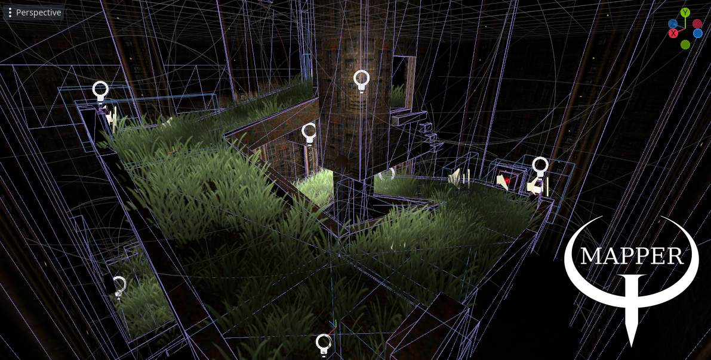

# Quake mapping plugin for Godot 4.x


Mapper plugin provides a way to manage game directories with map resources.<br>
Construct Godot scenes from maps using your own scripts and run them without the plugin.<br>
Organize map resources into game expansions by specifying alternative game directories.<br>

## Features
* Progressive loading of complex maps as scenes in a deterministic way.
* Automatic loading of PBR textures, animated textures and shader material textures.
* Effortless brush entity construction and animation using plugin functions.
* Safe entity property parsing and binding, entity linking and grouping.
* **Ability to scatter grass on textures and fill space with points!**
* Texture WAD and Palette support.
* Basic MDL support.

## Usage
### 1. Create game directory with map resources.
* game/builders for entity build scripts.
* game/materials for map materials with additional metadata.
* game/textures for textures with possible PBR or animation names.
* game/sounds for loading sounds with any of the supported extensions.
* game/maps for maps, also maps might embed each other in entity properties.
* game/mapdata for storing map lightmaps and navigation data.
* game/wads for additional texture WADs.
* game/mdls for animated models.

### 2. Construct map entities using build scripts.
Scripts inside builders directory are used to construct map entities.<br>
Entity classname property determines which build script the plugin will execute.<br>
Build scripts ending with underscore can be used to construct many similar entities.<br>
For example, trigger_.gd will be executed for trigger_once and trigger_multiple entities.<br>

#### MapperUtilities class provides smart build functions.
```
static func build(map: MapperMap, entity: MapperEntity) -> Node:
	return MapperUtilities.create_brush_entity(entity, "StaticBody3D")
```

Create entity node or nodes, set a script and bind entity properties.<br>
Entity linking information is also avaliable, but linked entities might not be constructed yet.<br>
Post build script named __post.gd can be executed after all entity nodes are constructed.<br>

### 3. Define map materials with additional metadata.
Materials support the same naming pattern as build scripts with underscore.<br>
Moreover, material named WOOD_.tres will also apply to WOOD1, WOOD2, etc.<br>
Shader materials that use standard texture parameters will be assigned provided textures.<br>
For example, albedo_texture or normal_texture uniforms inside a shader.<br>

#### Materials can affect how brush nodes are generated by specifying metadata flags.
* "mesh_disabled" set to True will disable MeshInstance3D.
* "cast_shadow" set to False will disable shadow casting on MeshInstance3D.
* "gi_mode" will set MeshInstance3D gi_mode to the specified mode.
* "ignore_occlusion" will disable occlusion culling for MeshInstance3D.
* "collision_disabled" set to True will disable CollisionShape3D.
* "collision_layer" will set CollisionObject3D layer to the specified layer,
* "collision_mask" will set CollisionObject3D mask to the specified mask,
* "occluder_disabled" set to True will disable OccluderInstance3D.
* "occluder_mask" will set OccluderInstance3D mask to the specified mask.

### 4. Animated textures and material slot alternative textures.
Generic textures are using complex naming pattern.<br>

#### Animated texture with 3 frames, possibly followed by PBR suffix.
* texture-0.png
* texture-1_albedo.png
* texture-2.png

#### Material slot alternative textures, possibly followed by animated texture suffix.
* texture+0.png
* texture+1-0.png
* texture+1-1_albedo.png
* texture+1-2.png
* texture+2_albedo.png

Quake textures with similar prefixes can also be loaded.<br>
Plugin supports multiple loading schemes for various resources.<br>
Custom loader can be implemented for your own assets.<br>

### 5. Bind entity properties to node properties.
Simple entity properties can be bound to entity node properties.<br>
Assignment of node properties happens after entity node is constructed.<br>
```
entity.bind_int_property("hp", "health")
```
Sometimes it's necessary to modify entity properties before assigning.<br>
```
entity_node.health = entity.get_int_property("hp", 0) / 2
```
Complex entity properties like signals or node paths can also be bound.<br>
For example, trigger might need to send a kill signal to another entity.<br>
```
entity.bind_signal_property(...)
entity.bind_node_path_property(...)
```

### 6. Assign navigation regions.
Various entities might affect navigation regions differently.<br>
Use entity node groups to manage entity navigation groups.<br>

## Examples
Check out provided examples to get a hang on API. <br>